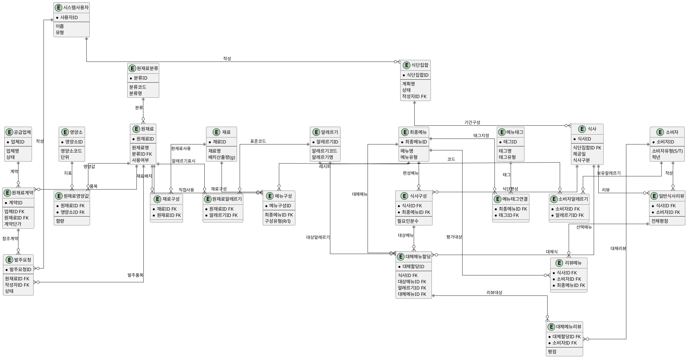
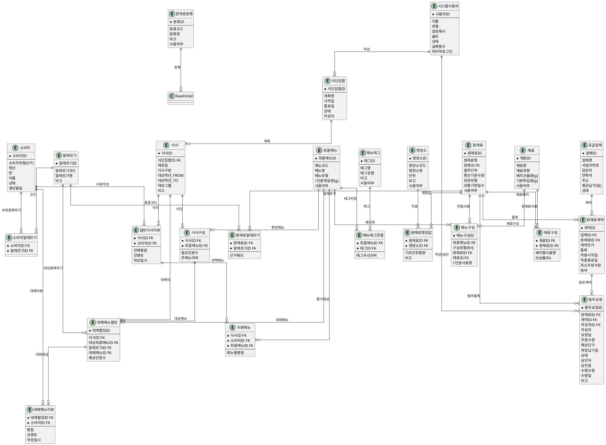

# 급식 영양·식자재 DB 설계 요약

## 1. 확정된 설계 방향 (근거 포함)
- **원재료/재료/최종메뉴 3계층**: 순환 참조를 막고 소스·반죽 등 중간 조합을 재료로 분리하여, 원재료 단위 발주·영양·알레르기 추적이 가능하도록 했다.
- **알레르기 정보 흐름**: 교육부 표준 22종 알레르기를 `Allergy` 마스터에 등록하고, 원재료에만 태깅 후 View(`FinalMenuAllergyView`)로 최종 메뉴 표기를 자동화해 유지보수를 단순화했다.
- **식단 단위 관리**: `MealPlan→Meal→MealComp` 구조로 월/주 계획 상태(작성/검토/확정)와 1식 구성을 분리하여, 계획 복제·승인 흐름을 지원한다.
- **소비자/대체 메뉴**: `ConsumerAllergy`로 학생·교직원 알레르기를 보관하고, `AltAssign`에서 식사·알레르기·대체 메뉴를 연결해 대상 인원 산정 및 대체 리뷰(`AltReview`) 수집이 가능하다.
- **리뷰 이원화**: `MealReview`는 식사 전체 만족도, `MealReviewItem`은 선택 메뉴별 평점을 저장해 식사/메뉴 통계를 분리하고, 대체 메뉴는 별도 리뷰 테이블로 관리한다.
- **발주/공급 관리**: `Vendor→RawContract→PurchaseRequest`로 공급업체·계약 단가·발주 흐름을 기록해, 향후 단가 변동·업체 신뢰도 통계를 쉽게 확장할 수 있게 했다.
- **사용자 인증/역할 분리**: `AppUser` 테이블에 PBKDF2 기반 해시/솔트와 `UserType`을 저장해, 로그인 후 영양사/관리자 UI를 분리하고 계정 잠금·로그 시각을 추적한다.

## 2. 주요 테이블 설계 (DDL 예시)
```sql
CREATE TABLE AppUser (
    UserID           VARCHAR2(50) PRIMARY KEY,
    UserName         VARCHAR2(100) NOT NULL,
    UserType         VARCHAR2(10) CHECK (UserType IN ('ADMIN','DIET')) NOT NULL,
    PasswordHash     VARCHAR2(200) NOT NULL,
    PasswordSalt     VARCHAR2(100) NOT NULL,
    Status           VARCHAR2(10) DEFAULT 'ACTIVE' NOT NULL,
    FailedLoginCount NUMBER(3) DEFAULT 0 NOT NULL,
    LastLoginAt      DATE,
    CreatedAt        DATE DEFAULT SYSDATE NOT NULL,
    CreatedBy        VARCHAR2(50) REFERENCES AppUser(UserID),
    UpdatedAt        DATE,
    UpdatedBy        VARCHAR2(50) REFERENCES AppUser(UserID)
);

CREATE TABLE RawCategory (
    RawCategoryID NUMBER PRIMARY KEY,
    CategoryCode  VARCHAR2(20) NOT NULL,
    CategoryName  VARCHAR2(50) NOT NULL,
    ActiveFlag    CHAR(1) DEFAULT 'Y' NOT NULL
);

CREATE TABLE RawMaterial (
    RawID          NUMBER PRIMARY KEY,
    RawName        VARCHAR2(100) NOT NULL,
    RawCategoryID  NUMBER NOT NULL REFERENCES RawCategory,
    PurchaseUnit   VARCHAR2(20) NOT NULL,
    BaseUnitQty    NUMBER(10,3) NOT NULL,
    StorageType    VARCHAR2(20),
    ShelfLifeDays  NUMBER(5),
    ActiveFlag     CHAR(1) DEFAULT 'Y' NOT NULL
);

CREATE TABLE Nutrient (
    NutrientID   NUMBER PRIMARY KEY,
    NutrientCode VARCHAR2(20) NOT NULL,
    NutrientName VARCHAR2(50) NOT NULL,
    Unit         VARCHAR2(10) NOT NULL,
    ActiveFlag   CHAR(1) DEFAULT 'Y' NOT NULL
);

CREATE TABLE RawNutrient (
    RawID         NUMBER NOT NULL REFERENCES RawMaterial,
    NutrientID    NUMBER NOT NULL REFERENCES Nutrient,
    AmountPerBase NUMBER(12,4) NOT NULL,
    CONSTRAINT PK_RawNutrient PRIMARY KEY (RawID, NutrientID)
);

CREATE TABLE Allergy (
    AllergyID   NUMBER PRIMARY KEY,
    AllergyCode VARCHAR2(10) NOT NULL,
    AllergyName VARCHAR2(50) NOT NULL
);

CREATE TABLE RawAllergy (
    RawID     NUMBER NOT NULL REFERENCES RawMaterial,
    AllergyID NUMBER NOT NULL REFERENCES Allergy,
    CONSTRAINT PK_RawAllergy PRIMARY KEY (RawID, AllergyID)
);

CREATE TABLE Ingredient (
    IngredientID       NUMBER PRIMARY KEY,
    IngredientName     VARCHAR2(100) NOT NULL,
    Type               VARCHAR2(30) NOT NULL,
    BatchYieldGram     NUMBER(10,2) NOT NULL,
    DefaultPortionGram NUMBER(8,2),
    ActiveFlag         CHAR(1) DEFAULT 'Y' NOT NULL
);

CREATE TABLE IngredientComp (
    IngredientID     NUMBER NOT NULL REFERENCES Ingredient,
    RawID            NUMBER NOT NULL REFERENCES RawMaterial,
    QuantityPerBatch NUMBER(10,2) NOT NULL,
    LossRatePct      NUMBER(5,2),
    CONSTRAINT PK_IngredientComp PRIMARY KEY (IngredientID, RawID)
);

CREATE TABLE FinalMenu (
    FinalMenuID      NUMBER PRIMARY KEY,
    MenuCode         VARCHAR2(30) NOT NULL,
    MenuName         VARCHAR2(100) NOT NULL,
    MenuType         VARCHAR2(20) NOT NULL,
    ServingSizeGram  NUMBER(8,2) NOT NULL,
    ActiveFlag       CHAR(1) DEFAULT 'Y' NOT NULL
);

CREATE TABLE MenuTag (
    MenuTagID  NUMBER PRIMARY KEY,
    TagName    VARCHAR2(50) NOT NULL,
    TagType    VARCHAR2(20) NOT NULL,
    ActiveFlag CHAR(1) DEFAULT 'Y' NOT NULL
);

CREATE TABLE MenuTagMap (
    FinalMenuID NUMBER NOT NULL REFERENCES FinalMenu,
    MenuTagID   NUMBER NOT NULL REFERENCES MenuTag,
    TagPriority NUMBER(3),
    CONSTRAINT PK_MenuTagMap PRIMARY KEY (FinalMenuID, MenuTagID)
);

CREATE TABLE MenuComp (
    MenuCompID             NUMBER PRIMARY KEY,
    FinalMenuID            NUMBER NOT NULL REFERENCES FinalMenu,
    ComponentType          CHAR(1) CHECK (ComponentType IN ('R','I')),
    ComponentRawID         NUMBER REFERENCES RawMaterial,
    ComponentIngredientID  NUMBER REFERENCES Ingredient,
    QuantityPerServing     NUMBER(10,3) NOT NULL
);

CREATE TABLE MealPlan (
    MealPlanID   NUMBER PRIMARY KEY,
    PlanName     VARCHAR2(100) NOT NULL,
    PeriodStart  DATE NOT NULL,
    PeriodEnd    DATE NOT NULL,
    Status       VARCHAR2(20) NOT NULL,
    CreatedBy    VARCHAR2(50) NOT NULL REFERENCES AppUser(UserID)
);

CREATE TABLE Meal (
    MealID          NUMBER PRIMARY KEY,
    MealPlanID      NUMBER NOT NULL REFERENCES MealPlan,
    MealDate        DATE NOT NULL,
    TargetGradeFrom NUMBER,
    TargetGradeTo   NUMBER,
    TargetGroup     VARCHAR2(30),
    Notes           VARCHAR2(200)
);

CREATE TABLE MealComp (
    MealID       NUMBER NOT NULL REFERENCES Meal,
    FinalMenuID  NUMBER NOT NULL REFERENCES FinalMenu,
    PortionCount NUMBER(6) NOT NULL,
    IsMainDish   CHAR(1),
    CONSTRAINT PK_MealComp PRIMARY KEY (MealID, FinalMenuID)
);

CREATE TABLE Consumer (
    ConsumerID    NUMBER PRIMARY KEY,
    ConsumerType  CHAR(1) CHECK (ConsumerType IN ('S','T')) NOT NULL,
    Grade         NUMBER,
    Class         VARCHAR2(5),
    Name          VARCHAR2(50) NOT NULL,
    Status        VARCHAR2(20) NOT NULL,
    BirthDate     DATE
);

CREATE TABLE ConsumerAllergy (
    ConsumerID NUMBER NOT NULL REFERENCES Consumer,
    AllergyID  NUMBER NOT NULL REFERENCES Allergy,
    CONSTRAINT PK_ConsumerAllergy PRIMARY KEY (ConsumerID, AllergyID)
);

CREATE TABLE AltAssign (
    AltAssignID          NUMBER PRIMARY KEY,
    MealID               NUMBER NOT NULL REFERENCES Meal,
    TargetFinalMenuID    NUMBER REFERENCES FinalMenu,
    AllergyID            NUMBER NOT NULL REFERENCES Allergy,
    FinalMenuID          NUMBER NOT NULL REFERENCES FinalMenu,
    TargetConsumerCount  NUMBER(5),
    CONSTRAINT FK_AltAssign_TargetMealComp
        FOREIGN KEY (MealID, TargetFinalMenuID)
        REFERENCES MealComp (MealID, FinalMenuID)
);

CREATE TABLE MealReview (
    MealID        NUMBER NOT NULL REFERENCES Meal,
    ConsumerID    NUMBER NOT NULL REFERENCES Consumer,
    OverallRating NUMBER(1) NOT NULL,
    CommentText   VARCHAR2(500),
    CreatedAt     DATE DEFAULT SYSDATE NOT NULL,
    CONSTRAINT PK_MealReview PRIMARY KEY (MealID, ConsumerID)
);

CREATE TABLE MealReviewItem (
    MealID      NUMBER NOT NULL,
    ConsumerID  NUMBER NOT NULL,
    FinalMenuID NUMBER NOT NULL REFERENCES FinalMenu,
    ItemRating  NUMBER(1),
    CONSTRAINT PK_MealReviewItem PRIMARY KEY (MealID, ConsumerID, FinalMenuID),
    CONSTRAINT FK_MealReviewItem_Review
        FOREIGN KEY (MealID, ConsumerID)
        REFERENCES MealReview (MealID, ConsumerID)
);

CREATE TABLE AltReview (
    AltAssignID NUMBER NOT NULL REFERENCES AltAssign,
    ConsumerID  NUMBER NOT NULL REFERENCES Consumer,
    Rating      NUMBER(1) NOT NULL,
    CommentText VARCHAR2(500),
    CreatedAt   DATE DEFAULT SYSDATE NOT NULL,
    CONSTRAINT PK_AltReview PRIMARY KEY (AltAssignID, ConsumerID)
);

CREATE TABLE Vendor (
    VendorID            NUMBER PRIMARY KEY,
    VendorName          VARCHAR2(100) NOT NULL,
    BusinessNumber      VARCHAR2(20),
    ContactName         VARCHAR2(50),
    ContactPhone        VARCHAR2(20),
    Address             VARCHAR2(200),
    DefaultLeadTimeDays NUMBER(3),
    Status              VARCHAR2(20) NOT NULL
);

CREATE TABLE RawContract (
    RawContractID  NUMBER PRIMARY KEY,
    VendorID       NUMBER NOT NULL REFERENCES Vendor,
    RawID          NUMBER NOT NULL REFERENCES RawMaterial,
    ContractPrice  NUMBER(12,2) NOT NULL,
    Currency       CHAR(3) NOT NULL,
    EffectiveStart DATE NOT NULL,
    EffectiveEnd   DATE,
    MinOrderQty    NUMBER(10,2),
    Notes          VARCHAR2(200)
);

CREATE TABLE PurchaseRequest (
    PurchaseRequestID NUMBER PRIMARY KEY,
    RawID             NUMBER NOT NULL REFERENCES RawMaterial,
    RawContractID     NUMBER REFERENCES RawContract,
    RequestedBy       VARCHAR2(50) NOT NULL REFERENCES AppUser(UserID),
    RequestedDate     DATE NOT NULL,
    Quantity          NUMBER(10,2) NOT NULL,
    UnitPriceEstimate NUMBER(12,2),
    ExpectedDeliveryDate DATE,
    Status            VARCHAR2(20) NOT NULL,
    ApprovedBy        VARCHAR2(50) REFERENCES AppUser(UserID),
    ApprovedDate      DATE,
    ReceivedQuantity  NUMBER(10,2),
    ReceivedDate      DATE,
    Remark            VARCHAR2(200)
);

- `AppUser.PasswordHash`는 클라이언트(C# WinForms)에서 `Rfc2898DeriveBytes`(PBKDF2)로 `PasswordSalt`를 붙여 계산한 Base64 문자열을 저장한다. 로그인 시 동일 방식을 사용해 `UserType`에 따라 화면을 분기한다.
```

## 3. 한국어 ER 다이어그램

- 핵심 흐름(원재료→재료→최종메뉴→식사→소비자/리뷰)과 발주 축(Vendor→RawContract→PurchaseRequest)을 중심으로, 이해에 필요한 엔티티만 배치했다.

## 4. 한국어 ER 다이어그램 (전체 필드)

- 모든 속성을 한국어로 표기한 상세 ERD 버전이다.
