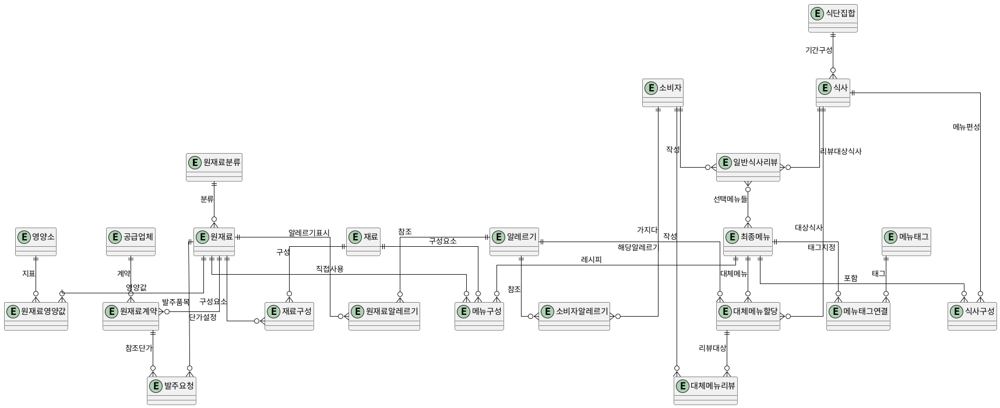

# 학교 급식 영양·식자재 관리 시스템 요약

## 프로젝트 개요
- C# .NET WinForms + 로컬 Oracle DB 기반의 학교 급식(초/중/고) 영양·식자재 관리 시스템.
- 재료와 메뉴 계층을 엄격히 나누어 알레르기, 영양소, 재고/발주 흐름을 추적할 수 있게 설계.

## 핵심 엔티티 계층
1. **원재료**
   - 구매/재고 관리의 최소 단위 (양파, 파, 고기, 혹은 완제품 소스 등).
   - 영양소 정보와 다중 알레르기 태그를 직접 보유.
2. **재료(중간 조합)**
   - 복수의 원재료로 구성되며 순환 참조는 금지.
   - 재료도 다른 재료/최종 메뉴에서 사용할 수 있음.
3. **최종 메뉴**
   - 식단에 바로 오를 수 있는 단위(반찬, 주메뉴, 국 등)만 포함.
   - 필요 시 소스 같은 조합 재료를 포함하되, 최종 메뉴끼리의 순환 참조는 없음.

## 알레르기 관리 흐름
- 알레르기 정보는 원재료 단계에 다대다 관계로 부착.
- 재료/최종 메뉴는 포함된 원재료의 알레르기 정보를 자동 상속.
- 소비자(학생/교사)는 보유 알레르기를 등록하고, 식단 편성 시 섭취 가능 여부를 자동 판정.
- 알레르기 대체 메뉴를 식사에 추가 배정하고, 해당 알레르기 보유자에게만 노출.

## 식단/식사 구조
- `최종 메뉴 → 식사(한 끼) → 식단 집합(주/월 단위)`의 계층으로 구성.
- 식사는 날짜/끼니/대상 학년 정보를 보유하고, 식단 집합은 기간별 편성을 관리.
- 식사 편성 시 알레르기 충돌 인원수를 계산해 대체 메뉴 수량을 산정.

## 평가(리뷰) 설계
1. **일반 식사 리뷰**
   - 소비자가 해당 식사에서 기억나는 몇 개의 메뉴만 선택해 간단 평가/코멘트.
   - UI는 체크박스 등으로 최소한의 입력만 요구.
2. **알레르기 대체 메뉴 리뷰**
   - 대체 메뉴를 실제 제공받은 소비자에게만 노출.
   - 대체 메뉴별 만족도/피드백을 별도 수집하여 품질 개선에 활용.

## 식자재 발주/공급 관리
- 원재료만 발주 대상으로 정의하되, 공산품·완제품도 원재료로 등록해 일관성 유지.
- **공급업체** 엔티티와 **원재료-업체 계약(단가)** 정보를 보관해 참조 단가/예산을 추적.
- **발주 요청**에는 품목, 수량, 희망 납기, 요청 사유, 상태(작성→승인→발주), 예상 금액을 저장.
- 상부 승인 시 실제 단가/납품 결과를 입력하면 향후 통계(단가 변동, 업체 신뢰도, 월별 예산) 구축이 용이.

## 엔티티 속성 상세

> 기본키 정책: 교차/로그성 엔티티는 가능하면 의미 있는 복합키로 정의하고, 해당 복합키가 4개 이상의 속성을 요구하거나 참조 무결성상 NULL을 포함하게 된다면 그때만 인공 PK(ID) 컬럼을 둔다. 아래 표에서는 이러한 원칙에 따라 PK 정보를 갱신했다.

### 재료/메뉴 영역

#### 원재료분류 (RawCategory)
| 속성 | 타입 예시 | 필수 | 설명 |
| --- | --- | --- | --- |
| RawCategoryID (PK) | NUMBER | Y | 분류 식별자 |
| CategoryCode | VARCHAR2(20) | Y | 예: GRAIN, VEGE, MEAT |
| CategoryName | VARCHAR2(50) | Y | 곡류, 채소류 등 표시명 |
| Description | VARCHAR2(200) | N | 비고 |
| ActiveFlag | CHAR(1) | Y | 사용 여부 |

#### 원재료 (RawMaterial)
| 속성 | 타입 예시 | 필수 | 설명 |
| --- | --- | --- | --- |
| RawID (PK) | NUMBER | Y | 내부 식별자 |
| RawName | VARCHAR2(100) | Y | 원재료 명칭 |
| RawCategoryID (FK) | NUMBER | Y | 분류 참조 |
| PurchaseUnit | VARCHAR2(20) | Y | 발주 단위(kg, 봉 등) |
| BaseUnitQty | NUMBER(10,3) | Y | 1발주단위 기준 g/개수 등 내부 환산값 |
| StorageType | VARCHAR2(20) | N | 상온/냉장/냉동 |
| ShelfLifeDays | NUMBER(5) | N | 유통기한(일) |
| ActiveFlag | CHAR(1) | Y | 사용 여부(Y/N) |

#### 영양소 (Nutrient)
| 속성 | 타입 예시 | 필수 | 설명 |
| --- | --- | --- | --- |
| NutrientID (PK) | NUMBER | Y | 영양소 식별자 |
| NutrientCode | VARCHAR2(20) | Y | 예: CARB, PROT, FIBER |
| NutrientName | VARCHAR2(50) | Y | 영양소 명칭 |
| Unit | VARCHAR2(10) | Y | g, mg 등 단위 |
| Description | VARCHAR2(200) | N | 비고 |
| ActiveFlag | CHAR(1) | Y | 사용 여부 |

#### 원재료영양값 (RawNutrient)
| 속성 | 타입 예시 | 필수 | 설명 |
| --- | --- | --- | --- |
| RawID (PK, FK) | NUMBER | Y | 대상 원재료 |
| NutrientID (PK, FK) | NUMBER | Y | 영양소 |
| AmountPerBase | NUMBER(12,4) | Y | 발주 단위(BaseUnit) 기준 함량 |
| Notes | VARCHAR2(200) | N | 수치 출처 등 |
> PK=(RawID, NutrientID)로 정의해 동일 원재료-영양소 조합을 1회만 기록한다.


#### 알레르기 (Allergy)
| 속성 | 타입 예시 | 필수 | 설명 |
| --- | --- | --- | --- |
| AllergyID (PK) | NUMBER | Y | 표준 알레르기 코드 |
| AllergyCode | VARCHAR2(10) | Y | 교육부 1~14분류 등 외부 코드 |
| AllergyName | VARCHAR2(50) | Y | 알레르기 명칭 |
| Description | VARCHAR2(200) | N | 비고 |

#### 원재료알레르기 (RawAllergy)
| 속성 | 타입 예시 | 필수 | 설명 |
| --- | --- | --- | --- |
| RawID (PK, FK) | NUMBER | Y | 대상 원재료 |
| AllergyID (PK, FK) | NUMBER | Y | 해당 알레르기 |
| EvidenceNote | VARCHAR2(200) | N | 표시 근거(라벨, 공급처 등) |
> PK=(RawID, AllergyID)로 두어 원재료별 알레르기 표기를 중복 없이 관리한다.

#### 재료 (Ingredient)
| 속성 | 타입 예시 | 필수 | 설명 |
| --- | --- | --- | --- |
| IngredientID (PK) | NUMBER | Y | 내부 식별자 |
| IngredientName | VARCHAR2(100) | Y | 명칭 |
| Type | VARCHAR2(30) | Y | 소스/양념/반죽 등 타입 |
| BatchYieldGram | NUMBER(10,2) | Y | 1배치 생산량(g) |
| DefaultPortionGram | NUMBER(8,2) | N | 최종 메뉴 투입 기준량 |
| ActiveFlag | CHAR(1) | Y | 사용 여부 |

#### 재료구성 (IngredientComp)
| 속성 | 타입 예시 | 필수 | 설명 |
| --- | --- | --- | --- |
| IngredientID (PK, FK) | NUMBER | Y | 상위 재료 |
| RawID (PK, FK) | NUMBER | Y | 사용 원재료 |
| QuantityPerBatch | NUMBER(10,2) | Y | 1배치당 투입량(구매단위 환산) |
| LossRatePct | NUMBER(5,2) | N | 가열/손질 손실율 |
> PK=(IngredientID, RawID)로 동일 원재료를 한 재료 레시피에서 중복으로 기록하지 않는다.

#### 최종메뉴 (FinalMenu)
| 속성 | 타입 예시 | 필수 | 설명 |
| --- | --- | --- | --- |
| FinalMenuID (PK) | NUMBER | Y | 식별자 |
| MenuCode | VARCHAR2(30) | Y | 급식 메뉴 코드 |
| MenuName | VARCHAR2(100) | Y | 메뉴명 |
| MenuType | VARCHAR2(20) | Y | 주식/주찬/부찬/국 |
| ServingSizeGram | NUMBER(8,2) | Y | 1인분 제공량 |
| ActiveFlag | CHAR(1) | Y | 사용 여부 |

#### 메뉴태그 (MenuTag)
| 속성 | 타입 예시 | 필수 | 설명 |
| --- | --- | --- | --- |
| MenuTagID (PK) | NUMBER | Y | 태그 식별자 |
| TagName | VARCHAR2(50) | Y | 예: 김치, 튀김, 절기:추석 |
| TagType | VARCHAR2(20) | Y | 요리종류/절기/테마 등 분류 |
| Description | VARCHAR2(200) | N | 비고 |
| ActiveFlag | CHAR(1) | Y | 사용 여부 |

#### 메뉴태그연결 (MenuTagMap)
| 속성 | 타입 예시 | 필수 | 설명 |
| --- | --- | --- | --- |
| FinalMenuID (PK, FK) | NUMBER | Y | 대상 최종 메뉴 |
| MenuTagID (PK, FK) | NUMBER | Y | 연결 태그 |
| TagPriority | NUMBER(3) | N | 태그 표시 우선순위 |
> PK=(FinalMenuID, MenuTagID)로 동일 태그를 한 메뉴에 중복 부여하지 못하게 한다.

#### 메뉴구성 (MenuComp)
| 속성 | 타입 예시 | 필수 | 설명 |
| --- | --- | --- | --- |
| MenuCompID (PK) | NUMBER | Y | 식별자 |
| FinalMenuID (FK) | NUMBER | Y | 상위 최종 메뉴 |
| ComponentType | CHAR(1) | Y | R=원재료, I=재료 |
| ComponentRawID (FK) | NUMBER | N | ComponentType=R일 때 참조 |
| ComponentIngredientID (FK) | NUMBER | N | ComponentType=I일 때 참조 |
| QuantityPerServing | NUMBER(10,3) | Y | 1인분 투입량(구매단위 환산) |

### 식단·소비자 영역

#### 식단집합 (MealPlan)
| 속성 | 타입 예시 | 필수 | 설명 |
| --- | --- | --- | --- |
| MealPlanID (PK) | NUMBER | Y | 식별자 |
| PlanName | VARCHAR2(100) | Y | 예: 2024-03 초등 점심 계획 |
| PeriodStart | DATE | Y | 시작일 |
| PeriodEnd | DATE | Y | 종료일 |
| Status | VARCHAR2(20) | Y | 작성/검토/확정 |
| CreatedBy (FK) | VARCHAR2(50) | Y | 작성자(AppUser) |

#### 식사 (Meal)
| 속성 | 타입 예시 | 필수 | 설명 |
| --- | --- | --- | --- |
| MealID (PK) | NUMBER | Y | 식별자 |
| MealPlanID (FK) | NUMBER | Y | 소속 식단집합 |
| MealDate | DATE | Y | 제공일 |
| TargetGradeFrom/To | NUMBER | N | 대상 학년 범위 |
| TargetGroup | VARCHAR2(30) | N | 초등부/교직원 등 |
| Notes | VARCHAR2(200) | N | 특이사항 |

#### 식사구성 (MealComp)
| 속성 | 타입 예시 | 필수 | 설명 |
| --- | --- | --- | --- |
| MealID (PK, FK) | NUMBER | Y | 식사 |
| FinalMenuID (PK, FK) | NUMBER | Y | 편성 메뉴 |
| PortionCount | NUMBER(6) | Y | 필요 인분 수 |
| IsMainDish | CHAR(1) | N | 주메뉴 여부 |
> 한 식사에서 동일 메뉴는 한 번만 편성된다는 전제를 활용해 PK=(MealID, FinalMenuID)로 지정했다.

#### 소비자 (Consumer)
| 속성 | 타입 예시 | 필수 | 설명 |
| --- | --- | --- | --- |
| ConsumerID (PK) | NUMBER | Y | 식별자 |
| ConsumerType | CHAR(1) | Y | S=학생, T=교직원 |
| Grade | NUMBER | N | 학년 (교직원은 NULL) |
| Class | VARCHAR2(5) | N | 반 |
| Name | VARCHAR2(50) | Y | 이름 (또는 익명코드) |
| Status | VARCHAR2(20) | Y | 재학/휴학/퇴직 |
| BirthDate | DATE | N | 선택 |

#### 소비자알레르기 (ConsumerAllergy)
| 속성 | 타입 예시 | 필수 | 설명 |
| --- | --- | --- | --- |
| ConsumerID (PK, FK) | NUMBER | Y | 소비자 |
| AllergyID (PK, FK) | NUMBER | Y | 알레르기 |
> PK=(ConsumerID, AllergyID)로 동일 알레르기를 한 소비자에게 중복 등록하지 못한다.

### 대체 메뉴/리뷰 영역

#### 대체메뉴할당 (AltAssign)
| 속성 | 타입 예시 | 필수 | 설명 |
| --- | --- | --- | --- |
| AltAssignID (PK) | NUMBER | Y | 식별자 |
| MealID (FK) | NUMBER | Y | 대상 식사 |
| TargetFinalMenuID (FK) | NUMBER | N | 대체 대상 원 메뉴(식사구성) |
| AllergyID (FK) | NUMBER | Y | 대응 알레르기 |
| FinalMenuID (FK) | NUMBER | Y | 제공할 대체 메뉴 |
| TargetConsumerCount | NUMBER(5) | N | 예상 인원 |
> TargetFinalMenuID는 MealComp(MealID, FinalMenuID)에 대한 복합 FK로 연결해, 어떤 메뉴를 대체했는지 명확히 식별한다.

#### 일반식사리뷰 (MealReview)
| 속성 | 타입 예시 | 필수 | 설명 |
| --- | --- | --- | --- |
| MealID (PK, FK) | NUMBER | Y | 리뷰 대상 식사 |
| ConsumerID (PK, FK) | NUMBER | Y | 작성자 |
| OverallRating | NUMBER(1) | Y | 1~5 점수 |
| CommentText | VARCHAR2(500) | N | 자유 코멘트 |
| CreatedAt | DATE | Y | 작성 일시 |
> 1명당 1식사 1건만 리뷰한다는 정책으로 PK=(MealID, ConsumerID)를 채택했다.

##### 일반식사리뷰-선택메뉴 연결 (MealReviewItem)
| 속성 | 타입 예시 | 필수 | 설명 |
| --- | --- | --- | --- |
| MealID (PK, FK) | NUMBER | Y | 상위 리뷰의 식사 |
| ConsumerID (PK, FK) | NUMBER | Y | 상위 리뷰의 작성자 |
| FinalMenuID (PK, FK) | NUMBER | Y | 평가한 개별 메뉴 |
| ItemRating | NUMBER(1) | N | 선택 메뉴별 점수 |
> PK=(MealID, ConsumerID, FinalMenuID)이며, (MealID, ConsumerID)로 MealReview와 조인한다.

#### 대체메뉴리뷰 (AltReview)
| 속성 | 타입 예시 | 필수 | 설명 |
| --- | --- | --- | --- |
| AltAssignID (PK, FK) | NUMBER | Y | 리뷰 대상 대체 메뉴 배정 |
| ConsumerID (PK, FK) | NUMBER | Y | 작성자 |
| Rating | NUMBER(1) | Y | 1~5 점수 |
| CommentText | VARCHAR2(500) | N | 의견 |
| CreatedAt | DATE | Y | 작성 일시 |
> PK=(AltAssignID, ConsumerID)로 동일 배정에 대해 한 소비자가 1회만 리뷰할 수 있다.

### 사용자/권한 영역

#### 시스템 사용자 (AppUser)
| 속성 | 타입 예시 | 필수 | 설명 |
| --- | --- | --- | --- |
| UserID (PK) | VARCHAR2(50) | Y | 로그인 ID, 전역 유일 |
| UserName | VARCHAR2(100) | Y | 표시 이름 |
| UserType | VARCHAR2(10) | Y | `ADMIN`/`DIET` 등 역할 코드 |
| PasswordHash | VARCHAR2(200) | Y | PBKDF2 등으로 해시한 값(Base64) |
| PasswordSalt | VARCHAR2(100) | Y | 사용자별 난수 솔트(Base64) |
| Status | VARCHAR2(10) | Y | ACTIVE/LOCK/INACTIVE |
| FailedLoginCount | NUMBER(3) | Y | 연속 실패 횟수(잠금 트리거용) |
| LastLoginAt | DATE | N | 마지막 로그인 시각 |
| CreatedAt | DATE | Y | 계정 생성 시각 |
| CreatedBy (FK) | VARCHAR2(50) | N | 생성자(AppUser) |
| UpdatedAt | DATE | N | 최종 수정 시각 |
| UpdatedBy (FK) | VARCHAR2(50) | N | 수정자(AppUser) |
> 비밀번호는 WinForms(C#)에서 `Rfc2898DeriveBytes`(PBKDF2) 같은 함수로 `PasswordSalt`를 사용해 해시한 뒤 저장한다. Oracle DB에는 해시/솔트를 그대로 문자열로 보관해 다른 클라이언트에서도 동일한 검증을 수행할 수 있다. `CreatedBy/UpdatedBy`는 AppUser(UserID)를 참조하지만 초기가입 편의를 위해 NULL 허용 후 별도 스크립트로 채운다.

- 로그인 성공 시 `UserType`을 `UserSession.Role`로 옮겨, WinForms 메인 폼에서 영양사/관리자 화면을 분기한다. 관리자(Admin)는 식단 확정/발주 조회 탭만 보이고, 영양사(Diet)는 식단 작성·재료 관리·발주 작성 메뉴를 모두 사용한다.

### 발주/공급 영역

#### 공급업체 (Vendor)
| 속성 | 타입 예시 | 필수 | 설명 |
| --- | --- | --- | --- |
| VendorID (PK) | NUMBER | Y | 식별자 |
| VendorName | VARCHAR2(100) | Y | 업체명 |
| BusinessNumber | VARCHAR2(20) | N | 사업자번호 |
| ContactName | VARCHAR2(50) | N | 담당자 |
| ContactPhone | VARCHAR2(20) | N | 연락처 |
| Address | VARCHAR2(200) | N | 소재지 |
| DefaultLeadTimeDays | NUMBER(3) | N | 평균 납기 |
| Status | VARCHAR2(20) | Y | 계약/중지 |

#### 원재료계약 (RawContract)
| 속성 | 타입 예시 | 필수 | 설명 |
| --- | --- | --- | --- |
| RawContractID (PK) | NUMBER | Y | 식별자 |
| VendorID (FK) | NUMBER | Y | 공급업체 |
| RawID (FK) | NUMBER | Y | 원재료 |
| ContractPrice | NUMBER(12,2) | Y | 단가(통화별) |
| Currency | CHAR(3) | Y | KRW 등 |
| EffectiveStart | DATE | Y | 적용 시작 |
| EffectiveEnd | DATE | N | 종료일 |
| MinOrderQty | NUMBER(10,2) | N | 최소 주문 수량 |
| Notes | VARCHAR2(200) | N | 특약 |

#### 발주요청 (PurchaseRequest)
| 속성 | 타입 예시 | 필수 | 설명 |
| --- | --- | --- | --- |
| PurchaseRequestID (PK) | NUMBER | Y | 식별자 |
| RawID (FK) | NUMBER | Y | 요청 품목 |
| RawContractID (FK) | NUMBER | N | 적용 계약 |
| RequestedBy (FK) | VARCHAR2(50) | Y | 작성자(AppUser) |
| RequestedDate | DATE | Y | 요청일 |
| Quantity | NUMBER(10,2) | Y | 주문 수량(발주 단위) |
| UnitPriceEstimate | NUMBER(12,2) | N | 예상 단가 |
| ExpectedDeliveryDate | DATE | N | 희망 납기 |
| Status | VARCHAR2(20) | Y | 작성/승인/발주/수령 |
| ApprovedBy (FK) | VARCHAR2(50) | N | 승인자(AppUser) |
| ApprovedDate | DATE | N | 승인일 |
| ReceivedQuantity | NUMBER(10,2) | N | 실제 수령 수량 |
| ReceivedDate | DATE | N | 입고일 |
| Remark | VARCHAR2(200) | N | 비고 |

## 파생 뷰/보고서 설계

### 최종메뉴-알레르기 뷰 (FinalMenuAllergyView)
- 목적: 최종 메뉴가 포함하고 있는 알레르기 목록을 번호(교육부 표준 코드)와 함께 즉시 조회해 "짬뽕 (1)(2)" 같은 표기를 지원.
- 구성: `FinalMenu → MenuComp → (Ingredient → IngredientComp → RawMaterial) / RawMaterial → RawAllergy → Allergy` 경로를 따라 모든 원재료의 알레르기 코드를 수집하고, 중복 제거 후 정렬.
- 구현 예시:
```sql
CREATE OR REPLACE VIEW FinalMenuAllergyView AS
SELECT DISTINCT
    fm.FinalMenuID,
    a.AllergyCode,
    a.AllergyName
FROM FinalMenu fm
JOIN MenuComp mc ON mc.FinalMenuID = fm.FinalMenuID
LEFT JOIN RawMaterial r_direct ON mc.ComponentType = 'R' AND mc.ComponentRawID = r_direct.RawID
LEFT JOIN Ingredient i ON mc.ComponentType = 'I' AND mc.ComponentIngredientID = i.IngredientID
LEFT JOIN IngredientComp ic ON i.IngredientID = ic.IngredientID
LEFT JOIN RawMaterial r_indirect ON ic.RawID = r_indirect.RawID
JOIN RawAllergy ra ON ra.RawID IN (r_direct.RawID, r_indirect.RawID)
JOIN Allergy a ON a.AllergyID = ra.AllergyID;
```
- UI/보고서에서는 `LISTAGG` 등을 사용해 `AllergyCode`를 "(1)(2)" 형태로 묶어 표기하고, 상세 설명에 `AllergyName`을 매핑해 표시.

## PlantUML ERD 스케치

